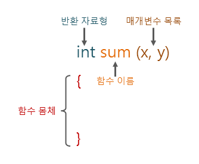
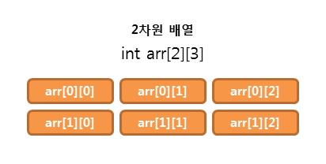
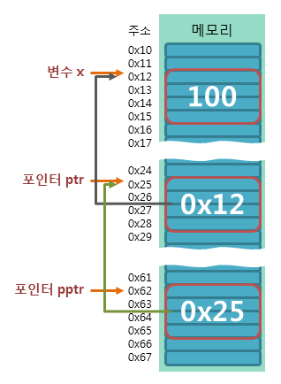
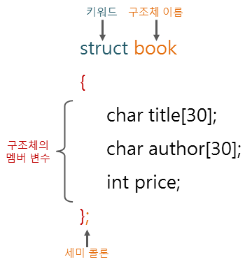
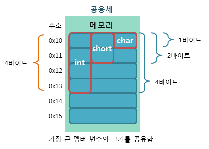

# C Language

## C언어
    C언어는 영국의 벨 연구소에서 1972년에 데니스 리치가 만든 프로그래밍용 언어로서 운영체제와 같은 시스템 소프트웨어를 개발하는 용도로 많이 사용되고 있는 컴파일러 방식의 고급언어이며, 속도가 빠르고, 바이너리 크기도 작아 메모리 제약이 따르는 분야에서 많이 선호하고 있다.

## C언어 프로그래밍 시작
    편집기에서 프로그래밍을 한 후 XXX.c로 저장하고, 컴파일 후 실행을 하도록 한다.

### 메인 함수 선언
```C
#include<stdio.h>

void main(){
    실행문장;
}
```

### 문자열 출력
```C
#include<stdio.h>

void main(){
    printf("문자열");
}
```

### 서식 지정자와 이스케이프 문자 활용
#### 서식 지정자
|지정자|의미|사용예|
|-----|-------------------------|----------------------|
|%d 또는 %i|부호 있는 10진 정수|printf("%d", -100)|
|%u|부호 없는 10진 정수|printf("%u", -100)|
|%ld|long 타입 10진 정수|printf("%ld", -100)|
|%lld|long long 타입 10진 정수|printf("%lld", -100)|
|%o|8진 정수|printf("%o", 100)|
|%x 또는 %X|16진 정수|printf("%x", 100)|
|%a 또는 %A|메모리 주소와 같은 16진 실수|printf("%a", 100)|
|%p|포인터 주소와 같은 16진 실수|printf("%p", ptr)|
|%f 또는 %F|실수|printf("%f", 3.14)|
|%lf|double 타입 실수|printf("%lf", 3.14)|
|%e 또는 %E|지수형태로 표기|printf("%e", 120000)|
|%s|문자열|printf("%s", "kimkitae")|
|%c|하나의 문자|printf("%c", 'k')|
|%%|% 기호 출력|printf("%%")|
|-|왼쪽 정렬|-|
|#|진법에 맞게 숫자 앞에 0을 붙임|-|
|0|출력하는 폭의 남는 공간에 0을 채움|-|
|.숫자|지정한 숫자만큼 소수점 아래 자리 표시|-|


#### 이스케이프 문자
|문자|의미|설명|
|-----|-------------------------|----------------------|
|\a|경보|경보를 울림 - 하드웨어에 따라 다름|
|\b|백스페이스|백스페이스를 누른 것과 같이 한 문자 앞으로 이동|
|\f|폼피드|커서를 다음 페이지의 시작부로 이동|
|\n|개행|커서를 다음 줄의 첫 번째로 이동|
|\r|캐리지 리턴|커서를 다음 줄로 넘기지 않고 첫 번째 위치로 이동|
|\t|수평 방향 탭|키보드에서 탭(tab) 키를 누른 것과 같이 이동|
|\v|수직 방향 탭|아래 방향으로 여러 줄을 건너뛰며 이동|
|\\|백 슬래시|특수문자 \를 표시|
|\'|작은 따옴표|특수문자 '를 표시|
|\"|큰 따옴표|특수문자 "를 표시|
|\o|8 진수 표기|숫자 앞에 \o를 표시하여 10진수와 구분함|
|\x|16 진수 표기|숫자 앞에 \x를 표시하여 10진수와 구분함|

#### 각주 처리
    // : 한 줄 각주 처리로 보통 해당 명령코드 끝에 설명을 붙임
    /* 설명 */ : 여러 줄 각주 처리로 시작시 '/*' 를 끝날 때는 '*/'를 붙임

```C
#include<stdio.h>

void main(){
    printf("당신의 이름은 %s 입니다.\n", "kimkitae");
}
```

## 변수와 자료형
    변수 : 프로그래밍에서 필요한 데이터를 메모리에 저장하게 되는데 저장된 데이터가 어디에 있는지의 위치를 주소라고 한다. CPU는 저장된 데이터의 위치인 주소를 보관하고 있다가 필요시에 해당 주소에 찾아가 데이터를 로딩한다. 그러나, 프로그래머는 그 주소를 일일히 알기 외우거나 알고 있기 힘들며, 또한, 컴퓨터 마다 배당되는 주소가 다르므로 데이터의 저장위치에 이름을 붙여 외우거나 알기 쉽도록 하기 위한 저장소의 이름을 변수명 또는 변수라고 하며, 변수는 언제든지 그 안에 들어 있는 값이 변할 수 있다는 것을 의미한다.
    자료형 : 데이터를 저장함에 있어 어떠한 데이터가 저장되는지에 따라 자료형을 나누게 된다. 정수, 실수, 문자, 문자열, 논리 등의 데이터를 저장하기 위해서는 거기에 합당한 형태의 변수가 필요한데, 반찬을 담는 것은 반찬통, 밥을 담는 것은 밥통, 국을 담는 것은 냄비가 되듯 올바르게 담아야지 그 특성을 유지할 수가 있기 때문이다.

### 변수 선언
    문법 : 자료형  변수명;

#### 변수명 규칙
    - 변수의 이름은 영문자(대소문자), 숫자, 언더스코어(_)로만 구성됨
    - 변수의 이름은 숫자로 시작될 수 없음
    - 변수의 이름 사이에는 공백을 포함할 수 없음
    - 변수의 이름으로 C언어에서 미리 정의된 키워드(keyword)는 사용할 수 없음

```C
//자료형  변수명;
int su1;
//여러 변수를 한 번에 선언
int su1, su2, su3
```

### 변수의 값 초기화
    변수에 가장 처음 값을 할당하는 것을 말한다.
```C
//변수 선언
int a;
//변수명=값
a=1004;
//변수의 선언과 초기화를 한 번에
int b=1052;
//여러 개 변수를 동시에 선언과 초기화
int i=10, j=20, k=30;
```

### 변수의 자료형 크기 반환
```C
//sizeof(자료형 또는 변수명)
sizeof(int);    //자료형의 크기
int data;
sizeof(data);   //변수의 자료형 크기
```

### 변수의 자료형이 갖는 표현 또는 저장 범위
|자료형|최소값|최대값|
|---------|--------|-----------|
|char|CHAR_MIN|CHAR_MAX|
|short|SHRT_MIN|SHRT_MAX|
|int|INT_MIN|INT_MAX|
|long|LONG_MIN|LONG_MAX|
|long long|LLONG_MIN|LLONG_MAX|
|unsigned char|0|UCHAR_MAX|
|unsigned short|0|USHRT_MAX|
|unsigned int|0|UINT_MAX|
|unsigned long|0|ULONG_MAX|
|unsigned long long|0|ULLONG_MAX|
|float|FLT_MIN|FLT_MAX|
|double|DBL_MIN|DBL_MAX|
|long double|LDBL_MIN|LDBL_MAX|


## 연산자

### 산술 연산자
|연산자|설명|
|--------|-------------|
|+|덧셈|
|-|뺄셈|
|*|곱셈|
|/|나눗셈|
|%|나머지|

### 대입 연산자
|연산자|설명|
|--------|-------------|
|=|오른쪽에 있는 값을 왼쪽 변수에 대입|
|+=|덧셈 후 할당|
|-=|뺄셈 후 할당|
|*=|곱셈 후 할당|
|%=|나머지를 구한 후 할당|

### 증감 연산자
|연산자|설명|
|--------|-------------|
|전위 ++a|1 증가, b = ++a; 증가 후 할당|
|후위 a++|1 증가, b = a++; 할당 후 증가|
|전위 --a|1 감소, b = --a; 감소 후 할당|
|후위 a--|1 감소, b = a--; 할당 후 감소|

### 비교 연산자
|연산자|설명|
|--------|-------------|
|==|일치, 동등, 같다|
|!=|불일치, 상이, 다르다|
|>|크다, 초과, 후|
|>=|크거나 같다, 이상, 이후|
|<|작다, 미만, 전|
|<=|작거나 같다, 이하, 이전|

### 논리 연산자
|연산자|설명|
|--------|-------------|
|&&|AND(논리곱), 양쪽 모두 참일 때 참|
|&#124;&#124;|OR(논리합), 양쪽 중 한쪽만 참이라도 참|
|!|NOT(논리 부정), 참과 거짓을 뒤집음|

### 비트 연산자
|연산자|설명|
|--------|-------------|
|&|비트 AND|
|&#124;|비트 OR|
|^|비트 XOR (배타적 OR, Exclusive OR)|
|~|비트 NOT|
|<<|비트를 왼쪽으로 시프트|
|>>|비트를 오른쪽으로 시프트|
|&=|비트 AND 연산 후 할당|
|&#124;=|비트 OR 연산 후 할당|
|^=|비트 XOR 연산 후 할당|
|<<=|비트를 왼쪽으로 시프트한 후 할당|
|>>=|비트를 오른쪽으로 시프트한 후 할당|

### 삼항 연산자
|연산자|설명|
|--------|-------------|
| ? : | 조건부 연산자. 조건식이 참이면 : 앞의 값을 반환, 거짓이면 : 뒤의 값을 반환 |


------------------------------------------------------------------


## 제어문 
    제어문에는 조건에 따라 작업의 흐름을 다르게 처리하는 조건분기문과 조건이 만족하는 동안 반복해야할 구문을 반복하는 반복문, 그리고,  상황에 따라 처리를 정지하거나 구간을 건너 띄는 기타 제어문으로 구분된다.

### 조건 분기문
    조건 분기문에는 if문과 switch문으로 구분되며, 필요에 따라 해당 구문을 선택하여 프로그래밍한다.

#### if문

```C
if(조건식) 실행할구문;       //조건이 만족할 때 실행할 구문을 처리함
```
※ 실행할 구문이 한 줄일 경우 중괄호"{ }"(프로그램 블록 구분자) 처리를 하지 않아도 됨

```C
if(조건식) {
    실행할구문1;       //조건이 만족할 때 실행할 구문을 처리함
    실행할구문2;
}
```
※ 중괄호"{ }"(프로그램 블록 구분자)의 끝에는 ;(세미콜론)을 붙이지 아니하며, if, switch, for, while 문장 등에서 적용된다.


#### if~else~문

```C
if(조건식) 조건이 참일 때 실행할구문1;       
else 조건이 거짓일 때 실행할구문2;
```
※ 실행할 구문이 한 줄일 경우 중괄호"{ }"(프로그램 블록 구분자) 처리를 하지 않아도 됨

```C
if(조건식) {
    실행할구문1;       //조건이 만족할 때 실행할 구문
    실행할구문2;
    ...
} else {
    실행할구문3;       //조건이 만족하지 않을 때 실행할 구문
    ....
}
```


#### if~else if~else문

```C
if(조건식1) 조건식1이 참일 때 실행할 구문1;       
else if(조건식2) 조건식1이 거짓이고, 조건식2가 참일 때 실행할 구문2;
.......
else 비교하는 모든 조건이 거짓일 때 실행할 구문;
```
※ 실행할 구문이 한 줄일 경우 중괄호"{ }"(프로그램 블록 구분자) 처리를 하지 않아도 됨

```C
if(조건식) {
    실행할구문;       
    실행할구문;
    ...
} else if() {
    실행할구문;       
    ....
} else {
    실행할구문;       
    ....
}
```

#### swith~case~문

```C
switch(기준변수 또는 기준값) {
    case 값1:   //기준변수나 기준값이 해당 값이 있는 case문을 선택하여 실행
        실행문;
        break;
    case 값2:
        실행문;
        break;
    ......
    case 값n:
        실행문;
        break;
    default:
        실행문;
}
```

### 반복문
    반복문에는 for문과 while문, do~while문이 있으며, 조건이 만족하는 동안 반복구간부를 반복 수행하게 된다.

#### for문
```C
for(초기값부여;조건식;증감식) {
    반복할 실행문;
    ....
}
```
※ 해당 문장이 초기값부터 증감식에 따라 조건식이 만족하는 동안 실행하게 됨

```C
for(초기값부여;조건식;증감식) {
    if(조건식) continue;
    반복할 실행문;
    ....
}
```
※ 해당 문장이 초기값부터 증감식에 따라 조건식이 만족하는 동안 실행하되 if조건에 만족하면 그 구간은 반복실행하지 않고 건너띔

```C
for(초기값부여;조건식;증감식) {
    if(조건식) break;
    반복할 실행문;
    ....
}
```
※ 해당 문장이 초기값부터 증감식에 따라 조건식이 만족하는 동안 실행하되 if조건에 만족하면 더 이상 반복하지 않고, for문 블록을 중지시킴

```C
for(;;) {
    반복할 실행문;
    ....
}
```
※ 조건식이 없거나 조건식이 항상 참일 경우는 무한루프가 되어 무한정 실행되게 된다.


#### while문
```C
초기값부여
while(조건식) {
    반복할 실행문;
    증감식;
    ....
}
```
※ 해당 문장이 초기값부터 증감식에 따라 조건식이 만족하는 동안 실행하게 되며, 조건식이 만족되지 않으면, while문 프로그램 블록을 벗어남

```C
초기값부여
while(true) {
    반복할 실행문;
    증감식;
    ....
}
```
※ 조건식이 true 이거나 항상 참일 경우는 무한루프가 되어 무한정 실행되게 된다.

#### do~while~문
```C
초기값부여
do {
    반복할 실행문;
    증감식;
    ....
} while(조건식);
```
※ 반복할 실행 문장을 우선 실행하고, 조건식이 만족하지 않으면 do문 프로그램 블록을 벗어나므로, 최소 1회 이상 실행한 구조임


### 기타 제어문
    기타 제어문으로는 상황에 따라 처리를 정지시키는 break문, 구간을 건너 띄는 continue문, 해당 프로그램 블록으로 이동하는 goto문이 있다.

#### break문
```C
while(true){
    if(조건식) break;
}
```
※ 계속 반복 수행하다가 조건이 만족하면, 반복 수행을 멈추도록 하므로, if문과 switch문에 부속 구문으로 사용된다.

#### continue문
```C
while(조건식){
    if(조건식) continue;
}
```
※ 계속 반복 수행하다가 if조건이 만족하면, 해당 구간을 건너띄기


-------------------------------------------------------------


## 함수(function)
    함수란 프로그래밍에서 하나의 특별한 목적의 작업을 수행하기 위해 독립적으로 설계된 프로그램 코드의 집합이라고 할 수 있으며, C 프로그램은 이러한 함수들로 구성되어 처리에 필요한 여러 기능을 작성할 수 있도록 한다.

### 함수의 장점
1. 반복적인 프로그래밍을 방지할 수 있다.
2. 복잡한 기능을 하나의 이름으로 정의하여 사용할 수 있다.
3. 모듈화로 인하여 전체적인 프로그램의 가독성을 높일 수 있다.
4. 프로그램이 문제가 발생하거나 기능의 변동이 있을 경우 함수를 수정하면, 쉽게 유지보수 할 수 있다.

### 함수의 정의

1. 반환 타입 : 함수가 요구 기능을 위한 작업이 완료하게 되면, 그 결과를 반환하는 데이터 타입을 명시한다.
2. 함수 이름 : 필요시 호출하게 될 함수의 이름을 명시한다.
3. 매개변수 목록 : 파라미터(parameter) 라고도 하며, 함수 호출 시에 함수에게 데이터를 전달할 필요성이 있을 경우 저장할 변수를 명시한다.
4. 함수 몸체 : 함수에서 필요한 기능을 처리하기 위한 하나 이상의 여러 명령문을 명시한다.

### 매개변수와 리턴이 없는 함수
```C
void 함수명() {
    처리구문;
}
```


### 매개변수는 있으며, 리턴이 없는 함수
```C
void 함수명(데이터타입 매개변수1[, 데이터타입 매개변수2,....]) {
    처리구문;
}
```


### 매개변수는 없고, 리턴이 있는 함수
```C
반환타입 함수명() {
    처리구문;
    return 반환타입에 맞는 변수 또는 값;
}
```


### 매개변수와 리턴이 모두 있는 함수
```C
반환타입 함수명(데이터타입 매개변수1[, 데이터타입 매개변수2,....]) {
    처리구문;
    return 반환타입에 맞는 변수 또는 값;
}
```


### 자기호출함수(recursive call back function)
    자기호출함수란, 함수 내부에서 자기 자신을 반복하여 호출하도록 하게 하므로써 실행을 여러 번 처리할 수 있도록 설계된 함수를 의미한다.
```C
반환타입 자기호출함수명(데이터타입 매개변수1[, 데이터타입 매개변수2,....]) {
    처리구문;
    return 자기호출함수명;
}
```    


-------------------------------------------------------------


## 배열(Array)
    같은 데이터 타입을 갖는 여러 개의 데이터 저장체인 변수를 하나의 같은 이름으로 묶고, 데이터는 순번(index)이라는 위치를 나타내는 번호에 맞도록 각 각 데이터를 저장하도록 하는 복수 데이터의 저장소를 말하며, 순번(index) 은 0부터 시작하여 양의 정수만을 가질 수 있다.
    

### 1차원 배열
```C
데이터타입  배열이름[배열길이];     //배열 선언
배열이름[인덱스] = 값;             //값 초기화 및 할당
```

```C
데이터타입  배열이름[배열길이] = {값1, 값2,..};     //배열 선언 및 초기화
```

```C
데이터타입  배열이름[] = {값1, 값2,..};     //배열 선언 및 초기화
```

### 2차원 배열
```C
데이터타입  배열이름[행의개수][열의개수];     //배열 선언
배열이름[행인덱스][열인덱스] = 값;             //값 초기화 및 할당
```

```C
데이터타입  배열이름[행의개수][열의개수] = {{값1, 값2,..},{값1, 값2,..},....};     //배열 선언 및 초기화
```

```C
데이터타입  배열이름[][] = {{값1, 값2,..},{값1, 값2,..},....};     //배열 선언 및 초기화
```

### 3차원 배열
```C
데이터타입  배열이름[면의개수][행의개수][열의개수];     //배열 선언
배열이름[면인덱스][행인덱스][열인덱스] = 값;             //값 초기화 및 할당
```

```C
데이터타입  배열이름[면의개수][행의개수][열의개수] = {{{값1, 값2,..},{값1, 값2,..},{값1, 값2,..}},....};     //배열 선언 및 초기화
```

```C
데이터타입  배열이름[][][] = {{{값1, 값2,..},{값1, 값2,..},{값1, 값2,..}},....};     //배열 선언 및 초기화
```

### 배열과 반복수행



```C
int arr[2][3] = {{10, 20, 30}, {40, 50, 60}}; 
for(int i=0;i<2;i++){
    for(int j=0;j<3;j++){
        printf(arr[i][j]+"\t");
    }
    printf("\n");
}
```

-------------------------------------------------------------


## 알고리즘(Algorithm)
    어떠한 문제를 해결하기 위한 일련의 절차나 방법을 공식화한 형태로 표현한 것을 의미하며, 이러한 문제 해결 방법 중에서 정확성과 효율성 등을 평가하여 최적의 알고리즘을 선택하여 프로그래밍하도록 한다.

### 알고리즘의 조건
1. 입력 : 외부에서 제공되는 자료가 0개 이상 존재한다.
2. 출력 : 적어도 2개 이상의 서로 다른 결과를 내어야 한다.
3. 명확성 : 수행 과정은 명확하고 모호하지 않은 명령어로 구성되어야 한다.
4. 유한성 : 유한 횟수의 명령어를 수행 후 특정 시간 내에 종료한다.
5. 효율성 : 모든 과정은 명백하게 실행 가능하거나 검증 가능 한 것이어야 한다.


### 순위 구하기
```C
int rank[5] = {1,1,1,1,1};      //모든 순위는 1위 부터 시작
for(int i=0;i<5;i++){
    for(int j=0;j<5;j++) {
        if(tot[i]<tot[j]) rank[i] += 1; //순위를 구하는 사람의 총점보다 비교가 되는 총점이 더 클 경우, 해당 사람의 순위는 1씩 증가된다.
    }
}
```

### 최대값 구하기
```C
int jum[5] = {90, 100, 80, 70, 60};
int max = 0;
for(int i=0;i<5;i++){
    if(jum[i]>max) max=jum[i]; //순회하여 최대값보다 더 큰 점수를 최대값으로 한다.
}
```


### 최소값 구하기
```C
int jum[5] = {90, 100, 80, 70, 60};
int min = 100;
for(int i=0;i<5;i++){
    if(jum[i]<min) min=jum[i]; //순회하여 최소값보다 더 작은 점수를 최소값으로 한다.
}
```

### 정렬(sort)하기
    정렬(Sort)란, 데이터를 순서대로 재배치하는 것을 의미하며, 점 점 값이 커지는 오름차순과 점 점 값이 작아지는 내림차순으로 나눌 수 있으며, 이러한 정렬을 구현하는 방법에는 순차(Sequence) 정렬, 선택(Selection) 정렬, 삽입(Insertion) 정렬, 버블(Bubble) 정렬, 병합(Merge) 정렬, 힙(Heap) 정렬, 퀵(Quick) 정렬, 기수(Radix) 정렬 등이 있다.

```C
//순차(Sequence) 정렬
int jum[5] = {90, 100, 80, 70, 60};
int imsi;
for(int i=0;i<5;i++){
    for(int j=0;j<5;j++) {
        if(jum[i]<jum[j]) { //오름차순 정렬하는 경우 작은 값이 있는 경우 값을 교체한다.
            imsi = jum[i];
            jum[i] = jum[j];
            jum[j] = imsi;
        }
    }
}
```

```C
//선택(Selection) 정렬
int jum[5] = {90, 100, 80, 70, 60};
int imsi;
for(int i=0;i<5;i++){
    for(int j=i+1;j<5;j++) {
        if(jum[i]<jum[j]) { //오름차순 정렬하는 경우 작은 값이 있는 경우 값을 교체한다.
            imsi = jum[i];
            jum[i] = jum[j];
            jum[j] = imsi;
        }
    }
}
```

```C
//버블(Bubble) 정렬
int jum[5] = {90, 100, 80, 70, 60};
int imsi;
for(int i=0;i<5;i++){
    for(int j=0;j<4-i;j++) {
        if(jum[j]<jum[j+1]) { //오름차순 정렬하는 경우 작은 값이 있는 경우 값을 교체한다.
            imsi = jum[j];
            jum[j] = jum[j+1];
            jum[j+1] = imsi;
        }
    }
}
```

```C
void quickSort(int arr[], int L, int R) {
//퀵(Quick) 정렬
int left = L, right = R;
int pivot = arr[(L + R) / 2];    // pivot(기준값) 설정 (가운데) 
int temp;
do {
    while (arr[left] < pivot)    
        left++;
    while (arr[right] > pivot)   
            right--;
    if (left<= right) {
        temp = arr[left];
        arr[left] = arr[right];
        arr[right] = temp;
        /*left 오른쪽으로 한칸, right 왼쪽으로 한칸 이동*/
        left++;
        right--;
    }
  } while (left<= right);
 
    /* 재귀처리 */
    if (L < right)
        quickSort(arr, L, right);    // 왼쪽 배열 재귀적으로 반복 
 
    if (left < R)
        quickSort(arr, left, R);    // 오른쪽 배열 재귀적으로 반복
}
void main(){
    int arr[5] = {90, 100, 80, 70, 60};
    quickSort(arr, 0, 4);
}
```

```C
//힙(Heap) 정렬
//heapify, 힙 상태 만들기 
void heapify(int *arr, int size){
	for(int i=1;i<size;++i){
		int child = i;
		do{
			//자식 노드가 부모 노드보다 크면 교환
			int root = (child-1)/2;
			if(arr[root]<arr[child]){
				int temp = arr[root];
				arr[root] = arr[child];
				arr[child] = temp;
			}
			child = root;
		}while(child!=0);	//최상단 노드까지 점검
	}
}

//최상단 노드와 최하단 노드 교체
void heap(int *arr, int *size){
	int temp = arr[0];
	arr[0] = arr[*size-1];
	arr[*size-1] = temp;
	--(*size);
}

int main(){
	
	int size = 10;
	//무작위 배열
	int arr[10] = {7, 5, 9, 6, 3, 8, 7, 10, 2, 1};
	
	//힙정렬
	for(int i=0;i<10;++i){
		heapify(arr, size);
		heap(arr, &size);
	}
	
	//출력 
	for(int i=0;i<10;++i){
		printf("%d ", arr[i]);
	}
	
	return 0;
}
```


```C
//래딕스(Radix) 정렬
//heapify, 힙 상태 만들기
#include <stdio.h>
#define MAX 20
int queue[MAX];
int front, rear = 0;
int put(int k){
    printf("QUEUE OVER FLOW!\n\n");
    if((rear+1) % MAX == front){        
        return -1;    
    } else {        
        queue[rear] = k;        
        rear = ++rear % MAX;        
        return 1;    
    }
}
int get(){    
    int k;    
    if(front == rear){        
        printf("QUEUE UNDER FLOW!\n\n");        
        return -1;    
    } else {        
        k = queue[front];        
        front = ++front % MAX;        
        return k;    
    }
}

void radix_sort(int array[], int size){    
    int max = array[0];
    int digit = 0;    
    int factor = 1;    
    for(int i=1; i<size; i++){        
        if(max<array[i]) max = array[i];
    }
    for(int i=max; i>0;i/=10){        
        digit++;    
    }    
    for(int i =0; i<digit; i++){         
        for(int j=0; j<10; j++){ // 0~9             
            for(int k=0; k<size; k++){                
                if((array[k]/factor)%10==j){                    
                    put(array[k]);                
                }            
            }        
        }        
        factor *=10;        
        for(int i=front; i!=rear; i++){            
            array[i] =get();        
        }        
        printf("########### %d ROUND ###########\n",i+1);        print_array(array,size);
        front=rear=0;    
    }
}

void main(){
    int array[] = {7, 5, 9, 6, 3, 8, 7, 10, 2, 1};    
    int size = sizeof(array)/sizeof(int);    
    radix_sort(array, size);
}
```

-------------------------------------------------------------


## 포인터(Pointer)
    포인터란, 데이터 주소 중에서 데이터가 저장된 메모리의 시작 주소를 의미하며, C언어는 주소값을 바이트 단위로 공간을 나누어 표현하게 된다. 이에 메모리의 주소값을 저장하기 위한 포인터 변수로 해당 데이터의 위치를 통하여 데이터에 접근할 수 있음


### 포인터 연산자
&변수명 : 주소 연산자로서 해당 변수의 주소값을 반환
*변수명 : 참조 연산자로서 해당 변수의 주소에 저장된 데이터를 반환

### 포인터의 선언 및 초기화
```C
타입*  포인터변수명;    //선언
타입*  포인터변수명 = &변수이름;    //선언과 초기화
타입*  포인터변수명 = 주소값;       //선언과 초기화2
```

```C
int x = 7;        // 변수의 선언
int *ptr = &x;    // 포인터의 선언
int *pptr = &ptr; // 포인터의 참조
```


포인터 예시
```C
int num01 = 1234;
double num02 = 3.14;  
int* ptr_num01 = &num01;
double* ptr_num02 = &num02; 

printf("포인터의 크기는 %d입니다.\n", sizeof(ptr_num01));
printf("포인터 ptr_num01이 가리키고 있는 주소값은 %#x입니다.\n", ptr_num01);
printf("포인터 ptr_num02가 가리키고 있는 주소값은 %#x입니다.\n", ptr_num02);
printf("포인터 ptr_num01이 가리키고 있는 주소에 저장된 값은 %d입니다.\n", *ptr_num01);
printf("포인터 ptr_num02가 가리키고 있는 주소에 저장된 값은 %f입니다.\n", *ptr_num02);
```


-------------------------------------------------------------


## 구조체(Structure type)
    구조체란, 배열과 같이 여러 데이터를 하나의 이름으로 저장할 경우에는 인덱스로 구분하므로 로딩되는 데이터가 어떤 데이터인지 정확히 알기가 힘들다. 그러한 경우, 하나의 변수에 각 각의 데이터가 가진 값들이 누구인지 알 수 있도록 하기 위해 멤버 변수를 두어 하나의 구조로 정의하여 활용하는 것을 말한다.

### 구조체의 정의
```C
struct 구조체이름 {
    멤버변수1의타입 멤버변수1의이름;
    멤버변수2의타입 멤버변수2의이름;
    ...
};
```



예시
```C
struct book {       //구조체 이름은 book
    char title[30];
    char author[30];
    int price;
};      //book 구조체를 갖는 구조체 변수명은 my_book

void main(){
    struct book my_book = {"HTML과 CSS", "홍길동", 28000};
    struct book java_book = {.title = "Java language", .price = 30000};  
    printf("첫 번째 책의 제목은 %s이고, 저자는 %s이며, 가격은 %d원입니다.\n", my_book.title, my_book.author, my_book.price);
    printf("두 번째 책의 제목은 %s이고, 저자는 %s이며, 가격은 %d원입니다.\n", java_book.title, java_book.author, java_book.price);
}

```

-------------------------------------------------------------------

## 공용체(Union Type)
    공용체란, 같은 멤버 등을 공유하는 것으로 하나의 멤버만 가질 수 있는 구조체의 일종이다.


### 공용체의 활용
```C
typedef union {
    데이터타입 멤버변수명;
    ....
} 멤버변수명;
```

예시
```C
typedef union {
    unsigned char a;
    unsigned short b;
    unsigned int c;
} SHAREDATA;

void main(){
    SHAREDATA var;
    var.c = 0x12345678;  
    printf("%x\n", var.a);
    printf("%x\n", var.b);
    printf("%x\n", var.c);
}
```

## 열거형(Enumerated Type)
    열거형이란, 여러 멤버 상수값을 가진 데이터를 데이터 변함없이 항상 같은 값을 가지는 열거 데이터를 하나의 묶음으로 활용하는 형태

### 열거형의 선언
```C
enum 열거형이름 { 멤버상수명1=값1[, 멤버상수명2=값2],...};
```

### 열거형의 활용
```C
enum 열거형이름 변수명;
변수명 = 멤버상수명;
```

예시
```C
enum Weather {SUNNY = 0, CLOUD = 10, RAIN = 20, SNOW = 30};  

void main() {
    enum Weather wt;  
    wt = SUNNY;  

    switch(wt) {
        case SUNNY:
            puts("오늘은 햇볕이 쨍쨍!");
            break;
        case CLOUD:
            puts("비가 올락말락하네요!");
            break;
        case RAIN:
            puts("비가 내려요.. 우산 챙기세요!");
            break;
        case SNOW:
            puts("오늘은 눈싸움하는 날!");
            break;
        default: puts("도대체 무슨 날씨인건가요!!!");
    }  
    puts("각각의 열거체에 해당하는 정수값은 다음과 같습니다.");
    printf("%d %d %d %d\n", SUNNY, CLOUD, RAIN, SNOW);
}
```


